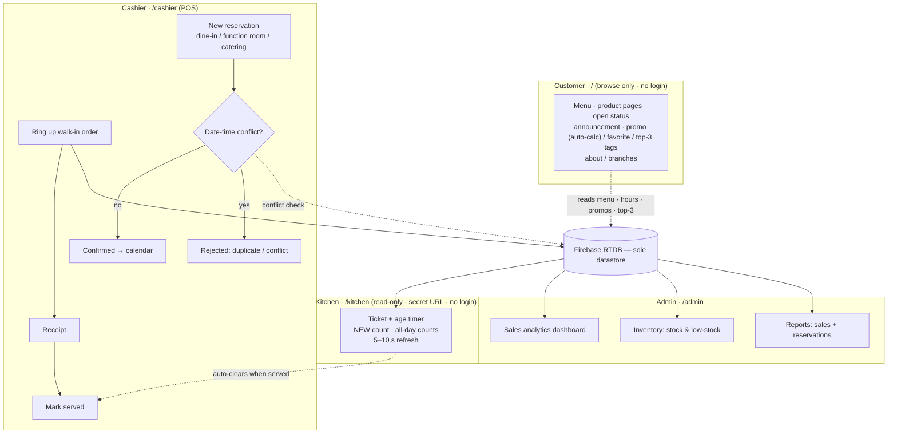

# Crates N' Plates Online Management System

> Living plan for the project, published as README for the team.
> Updated as decisions firm up.
> Last updated: 2026-09-22.

## 1. Vision

One web app that runs **Crates N' Plates Diner** online and in-store:
customers browse the menu and shop information online (no accounts, no
checkout), staff schedule dine-in, function
room, and catering reservations, cashiers run the counter POS, the kitchen
watches a read-only ticket display, the owner
manages menu, inventory, staff, settings, sales analytics, and reports.
Capstone title says **"Online Management System"** — it must run on the
internet, demonstrated end-to-end, not localhost-only.

| Area | URL prefix | Purpose | Runs |
|---|---|---|---|
| Customer | `/` | **Browse only:** menu, product pages, about/branches — open/closed status, announcement banner, item tags. No login, no cart | Online (showcase) |
| Cashier/POS | `/cashier` | Walk-in orders, **split payment (GCash + cash)**, **reservation scheduling** (dine-in, function room, catering), receipts | In-store via Docker, online reachable |
| Kitchen | `/kitchen` | **Read-only** ticket display: new-order count, age timers, all-day counts — no login, no cook interaction | In-store via Docker |
| Admin | `/admin` | Dashboard (sales analytics), products + inventory, staff, settings, reports | Both |

Domain vocabulary: **orders** are recorded at the counter, cooked, and
delivered — no status workflow; they exist for receipts, sales records, and
analytics. The kitchen display mirrors **open (unserved) orders** read-only
and clears when the cashier marks an order served.
**Reservations** (dine-in, function room, catering) are
staff-entered on a centralized calendar — conflict and duplicate checks
before confirm.

### System flow



`flow.html` (same directory) renders this block and re-renders it every
5 s while README.md changes — serve the folder over HTTP and the diagram
tracks this plan live.

## 2. Stack — decided

| Layer | Choice | Why |
|---|---|---|
| Framework | **Laravel 12 (PHP 8.2+)** | Routing, session auth, validation, queues, Blade — the boring default. |
| Views | **Blade + plain CSS (design tokens + component classes)** | Server-rendered, no SPA, no Inertia — and **zero build step**: no npm, no Vite, no Node anywhere. One `public/css/app.css`. |
| Motion | **CSS transitions + Web Animations API** | No animation library. Transitions for hover/toggle/focus, keyframes for toasts, native WAAPI for the rare choreography (badge bump, card stagger). Framer Motion (React-only) and `motion` both rejected — add a lib only if choreography proves painful. |
| Database | **Firebase Realtime Database, sole datastore** | One source of truth; no migrations while the schema churns; matches the declared capstone stack. Laravel does *not* use Eloquent/SQL — persistence goes through a thin RTDB service. |
| Kitchen display | **Auto-refreshing read-only page (5–10 s fetch)** | One endpoint returning open orders. No websocket, no cook session — the route is gated by a shared-secret URL instead of a login. |
| Local runtime | **Docker** (single `php:8.2-apache` app container, no DB container — the DB is Firebase) | Same image locally and on Render; stations on the LAN browse to it. |
| Hosting | **Render free** (`render.yaml` Blueprint) + existing 14-min keepalive | Sleep acceptable; `Projects/ping` + in-container cron hold it warm. Health route `/health`. |
| Quality | Pint (Laravel's php-cs-fixer preset), PHPStan (larastan), Pest smoke tests | Lint, static analysis, offline smoke tests — one command each. |

**Explicitly rejected** (record so they don't creep back in):

- React / Inertia / Next.js — nothing needs them without a React animation lib.
- Tailwind / Vite / any build toolchain — the app needs one stylesheet, not a
  Node toolchain. Plain CSS with tokens + component classes; revisit only if
  hand-CSS becomes the bottleneck.
- Framer Motion / `motion` / any animation library — CSS + WAAPI covers it; revisit only with a concrete choreography requirement.
- SQL/Eloquent alongside Firebase — two sources of truth = sync bugs.
- Firebase Auth — second auth system beside Laravel's; Laravel session auth
  covers all three roles. Revisit only if Google sign-in becomes a requirement.
- Customer accounts / OTP / cart / checkout — client says the current
  user-side flow won't be used; the public site is browse-only.
- Customer self-serve reservation portal — reservations are staff-entered;
  a portal would race the staff calendar for no promised requirement.
- Contact/chat/ask-questions — needs an inbox, moderation, and spam
  filtering or it rots; declined at the probe gate.
- Gmail API email — lost its last consumer (no OTP, no email receipts;
  receipts print at the counter). Re-add only when something must be emailed.
- Order status workflow / drag-and-drop ticket boards — cooked food is
  carried to the table; making the cook maintain columns/statuses is
  information tax (harsh-cook review: 2/10). The kitchen screen is
  read-only; cook interaction: none.
- WebSockets/Reverb — the kitchen page just fetches every 5–10 s; no push
  infrastructure.

## 3. Design system

### Interaction

- Mobile-first breakpoints; cashier touch targets ≥44 px.
- Kitchen screen: **zero cook interaction** — no login, touch, or editing;
  shared-secret URL, auto-clears when the cashier marks served.
- Every destructive action gets a confirm (one reusable pattern, not three).
- Empty states designed, not default: "No orders waiting — line is clear."

### Click-first UX — everywhere (client, cashiers, cooks: non-technical)

Hard rule: **the system computes, the human only supplies values or
presses buttons.** No screen anywhere asks a person to do math, write a
label, or enter a code — promo prices, "% off" labels, stock totals,
booking conflicts, change due, open status, top-3, receipts, report
totals: all derived.

Per surface:

- **Public site** — the customer supplies *nothing*: no accounts, no
  forms; hours, status, tags, top-3 all computed for them.
- **Cashier/POS** — tap tiles build the order; promo price, totals, and
  change compute themselves; payment is two tenders (GCash + cash,
  split allowed — cashier types one number, the other and the change
  compute themselves); receipt = one button; reservation =
  the guided screen below.
- **Kitchen** — total by design: zero input, zero login, zero editing.
- **Admin** — buttons over forms: one **Add promo** button per product
  row → segmented `% / ₱` control + one number + live preview ("customer
  sees ~~₱250~~ **₱200**") → Save; remove = one click. Product form stays
  promo-free.
- **Reports** — one-click date ranges; totals and charts build
  themselves; no configuration.

Universal patterns:

- **≤3 inputs per screen.** Anything longer becomes a single-purpose
  guided screen (reservation: name, phone, date/time, heads, type →
  confirm → conflict check runs itself).
- **Smart defaults pre-filled** (opening hours, receipt header,
  low-stock threshold): the human edits only what differs.
- **Inline steppers over edit forms** — stock adjust is `− / +` on the
  row, not a modal.
- **Every click confirms itself**: toast + row updates in place
  (destructive keeps the confirm rule above).

### Density — the "3 + 1" cozy rule (screen-by-screen)

Research backing: `research/screen-density-2026.md` (13 primary sources:
NN/g progressive disclosure / Hick / content-to-chrome, Lewis & Sauro
2024 clutter study, WCAG 2.2, Material + Carbon density models).

**The rule: ≤3 primary actions + 1 labeled overflow ("More…") per view.
Everything else lives exactly one disclosed step away — max 2 levels,
label carries clear information scent.**

Per-screen checklist (apply to every screen built):

1. **Earn its place** — on first paint, a control stays visible only if
   the current task needs it or staff use it daily. Else → overflow.
2. **Count commands, not content** — the budget counts actionable
   commands (save, cancel, add, edit, delete, nav). Content items that
   happen to be tappable (menu tiles, table rows) don't count, but must
   be grouped into sections/categories.
3. **≤9 visible commands per viewport** before grouping/overflow takes
   the rest. Every extra visible choice slows every decision (Hick).
4. **Squint test** — no two same-weight, same-style buttons in one
   visual group; hierarchy via size/contrast/grouping, not more buttons.
5. **Chrome never hides** — nav always visible and labeled; never an
   unlabeled icon (discover → recall → interaction-cost, NN/g).
6. **Floors** — targets ≥24×24 CSS px (WCAG 2.5.8); reflow at 320 px;
   overflow uses "Show more", never silent truncation (WCAG 1.4.10).
7. **Declutter order** — discard task-irrelevant content first, then
   reorganize the rest (grouping + whitespace); only then judge the
   screen dense (Lewis & Sauro 2024: clutter = content → discard,
   design → reorganize).

**Density by surface:** *comfortable* default (public site, cashier
POS); *compact* permitted only on read-only glanceable surfaces (kitchen
display, admin tables) and only after grouping/whitespace — mirroring
Material's three tiers and Carbon's per-screen model. "Dense" never
means sub-minimum tap targets.

## 4. Deployment topology

```
                ┌────────────────────────────────┐
                │ Firebase RTDB — sole datastore │
                │ indexed queries, rules locked  │
                └──────▲────────────────▲────────┘
                       │ REST (OAuth)   │
        LAN (Docker)   │                │   Online (Render free)
  ┌────────────────────┴───┐      ┌─────┴──────────────────────┐
  │ one container, same    │      │ same image, crnp-web       │
  │ image: /cashier        │      │ / user site + /admin       │
  │ /admin                 │      │ keepalive cron 14 min      │
  └────────────────────────┘      └────────────────────────────┘
```

One codebase, one image, one database — the "online vs in-store" split is
just **who opens which URL**, not two systems.

Free-tier known limits (accepted for demo):
- Instance sleeps after ~15 min idle → keepalive cron inside the container.
- Ephemeral `uploads/` → images lost on redeploy. Acceptable for demo;
  production = mounted disk or move images to Firebase Storage (open #1).

## 5. Roadmap

1. **Scaffold** — `composer create-project`, git, `public/css/app.css`
   tokens, Dockerfile + docker-compose boots `php artisan serve`/apache at
   `/public`, `/health` route, empty `render.yaml` deploys green. Start the
   root `CONVENTIONS.md` (indexed RTDB queries, stock
   decrement-after-insert, role guards, Asia/Manila
   timezone, `route()` URL generation).
2. **RTDB data layer** — `RtdbClient` (service-account OAuth token cache),
   thin models (Order, Reservation, Product + stock, Staff, Settings),
   `database.rules.json` with `.indexOn` for every query;
   Pest smoke test against a rules fixture.
3. **Auth & roles** — Laravel session auth, role guards for cashier and
   admin (middleware per prefix); seeded staff accounts (no public signup,
   no OTP); rate-limited logins. `/kitchen` is a separate
   read-only route gated by a shared-secret URL — no session, kiosk-level
   access (satisfies the thesis's "kitchen personnel" RBAC slot without a
   line-cook login).
4. **Public site** — landing: menu grid → product page, plus about /
   branches page. Read-only RTDB reads; no accounts, no cart, no forms.
   - **Open/closed badge** — computed from admin-configured hours per
     weekday, evaluated in `Asia/Manila` (Render runs UTC), with an admin
     **force-close override** (holiday / temporary closure).
   - **Announcement banner** — admin-written promo text + show/hide toggle
     in settings.
   - **Item tags** (chips on product cards):
     - **promo** — admin enters *either* a discount percent *or* an exact
       promo price; the sibling value and the "% off" label are computed,
       never typed (stored as `promoMode` + `promoValue`, re-derived on any
       base-price edit, validated `0 < promoPrice < price`). Same fields
       drive the POS total — site and receipt can't disagree; original
       shown struck through.
     - **house favorite** — admin toggle.
     - **top 3 · last 7 days** — auto from sales data; shows nothing
       until a week of sales exists.
5. **Cashier + kitchen + reservations** — POS console with **split
   tender** (GCash + cash on one order: one number typed, the other and
   the change compute themselves; order stores `payments:
   [{method, amount}]`, receipt prints the breakdown); read-only
   `/kitchen`: new-order count (flashing), per-ticket age timers (red at
   12 min), all-day counts, 5–10 s auto-refresh, cleared by cashier's
   "mark served"; **reservation scheduling
   module**: new booking (type: dine-in / function room / catering, date,
   time, party), calendar/list view, date-time conflict + duplicate check,
   confirm/cancel statuses; smoke test: order rings up → appears on kitchen
   screen → mark served clears it, and a conflicting reservation is
   rejected.
6. **Admin** — sales analytics dashboard: KPIs + 7-day trend (RTDB range
   queries), best-sellers, peak hours; products CRUD with content-addressed
   image uploads, **one-click Add-promo** (percent or exact price —
   sibling value and label auto-computed, per §3 click-first UX) +
   **house-favorite toggle** (feeds the
   public site tags; top-3 tag is computed from this phase's sales data) +
   **inventory monitoring** (stock movement, low-stock flags, inventory
   reports); staff accounts, business settings (**hours per weekday,
   force-close toggle, announcement banner**); sales and
   reservation reports with date filters.
7. **Design pass** — apply §3 everywhere: dark mode audit, motion
   choreography on the public site only, empty states, receipts.
8. **Demo path + hardening** — scripted capstone happy path (browse menu →
   cashier rings up an order → kitchen screen flashes the ticket with a
   running timer → mark served clears it → receipt; plus reservation:
   enter → conflict
   blocked → confirm →
   shows on calendar; plus report: sale appears in
   analytics dashboard); RTDB rules lockdown;
   weekly export-backup documented.

## 6. Open decisions

- [ ] **#1 Uploads** — base64-in-RTDB (fine for menu-photo/QR scale) vs Firebase Storage (photos).
