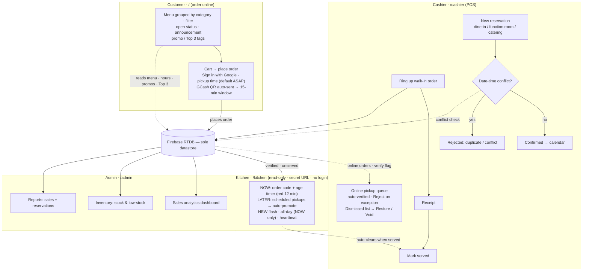

# Crates N' Plates Online Management System

> Living plan for the project, published as README for the team.
> Updated as decisions firm up.
> Last updated: 2026-09-22.

## 1. Vision

One web app that runs **Crates N' Plates Diner** online and in-store:
customers order online for **pickup** (browse menu → cart → place
order → GCash QR sent automatically → pay + upload proof → collect at
the counter with their order code); onsite customers are rung up at
the counter POS; staff schedule dine-in, function room, and catering
reservations, cashiers run the counter POS, the kitchen
watches a read-only ticket display, the owner
manages menu, inventory, staff, settings, sales analytics, and reports.
Capstone title says **"Online Management System"** — it must run on the
internet, demonstrated end-to-end, not localhost-only.

| Area | URL prefix | Purpose | Runs |
|---|---|---|---|
| Customer | `/` | **Online ordering (pickup):** category menu → cart → place order → GCash QR auto-sent (proof auto-verified); product pages, about/branches, open/closed status, announcement banner, item tags, favorites; **Sign in with Google** required to order | Online (showcase) |
| Cashier/POS | `/cashier` | Walk-in orders, **split payment (GCash + cash)**, **online pickup queue** (auto-verify → Reject exception, Dismissed / Unclaimed lists), **reservation scheduling** (dine-in, function room, catering), receipts | In-store via Docker, online reachable |
| Kitchen | `/kitchen` | **Read-only** ticket display: **NOW** (oldest-first, age timers, all-day) + **LATER** (scheduled pickups, auto-promoted) — no login, no cook interaction | In-store via Docker |
| Admin | `/admin` | Dashboard (sales analytics), products + inventory, staff, settings, reports | Both |

Domain vocabulary: **orders** come from two origins — online
(pickup-only, GCash-only, identified by **order code**, no table
field) and the counter (cashier walk-in at the POS, split tender,
table name added there) — into one shared stream. **Payment is the
gate:** no cashier approval before the QR — placing the order
auto-sends it (15-min payment window), and the customer's uploaded
GCash screenshot **auto-verifies**; the cashier taps **Reject** only
on exception (default-yes, human as exception — one tap per order on
the happy path: **Mark served**). Miss the window → **Dismissed**
(active queue auto-clears, kept in a Dismissed list for Restore/Void,
customer's screen flips in-session). Paid but never collected →
**Unclaimed** (money kept, manual note). The kitchen display mirrors
**verified, unserved** tickets read-only — order code on the ticket —
and clears when the cashier marks served. Cook interaction:
none — the server owns lane promotion and expiry (roadmap 5 board
spec). **Reservations** (dine-in, function room, catering) are
staff-entered on a centralized calendar — conflict and duplicate checks
before confirm.

### System flow



Per-role flowcharts: [customer](flow-charts/customer.md) ·
[cashier](flow-charts/cashier.md) ·
[kitchen](flow-charts/kitchen.md) ·
[admin](flow-charts/admin.md).

### Customer side — feature list

All at `/`. **Browse is open to everyone; ordering, favoriting, and
preference sync require Sign in with Google.**

**A. Browse — no login**

1. **Menu (landing)** — products grouped under category titles
   ("All Products"); promo prices struck through with computed "% off".
2. **Category filter** — tap a category chip → only that category.
3. **Product cards** — image, price, **promo** and **Top 3** tags
   (ranked live over the FIFO window), favorite
   heart (tapping while signed out prompts the Google button).
4. **Product page** — image, price/promo, details.
5. **Open/closed badge** — computed from admin hours per weekday +
   force-close toggle; place-order disabled while closed.
6. **Announcement banner** — admin-written, site-wide.
7. **About / branches** page.
8. **Cart** — inline steppers, add-on picks, computed totals (the
   system does the math; the human types nothing).

**B. Account — one Google button**

9. **Sign in with Google** — no form, no OTP, no password; session
   remembered; browsing never gated.
10. **Favorites** — heart toggles per-account favorites, synced
    cross-device via `users/{uid}`.
11. **Saved add-on prefs** — a product's last add-on selection comes
    pre-checked next visit, on any device.

**C. Checkout — login required, 3 taps**

12. **Pickup time** — optional picker, **default = ASAP** (no typing);
    earliest selectable = now + 15 min; the picker refuses too-soon
    times, never an error after payment.
13. **Payment — GCash only** (no Pay at Counter online; paying before
    cooking is the no-show assurance). Place order → QR appears
    instantly in its **branded frame** (official image, never
    re-rendered) and the **15-min payment window** starts — no cashier
    approval in front of it.
14. **Place order** — POST to Laravel → validated, stock-checked,
    `throttle`d per-IP → **order code** returned (the code identifies
    the pickup; no table field).

**D. After ordering**

15. **Pay + prove** — customer pays GCash → uploads the confirmation
    screenshot from the order screen → **auto-verified** (cashier taps
    **Reject** only when bogus) → kitchen ticket appears the same
    instant. No payment by 15:00 → **Dismissed**: the order screen
    flips to "Order dismissed — no payment received", the cashier's
    queue auto-clears, the order lands in the **Dismissed list**
    (Restore / Void).
16. **Collect** — cooked → cashier **Mark served** (the single happy-
    path tap) → customer collects with the **order code** → order
    feeds sales & analytics. Paid but never collected → **Unclaimed**
    (money kept). No order history in v1.

### Customer flow

1. **Arrive** — `/` shows menu, open/closed badge, banner, tags,
   computed prices. No wall.
2. **Browse** — filter by category → product page → add to cart
   (steppers, add-ons; heart prompts sign-in if signed out).
3. **Order** — cart → *Sign in with Google* (once) → pickup time
   (default ASAP) → Place order → **GCash QR appears immediately**
   (auto-sent, 15-min window starts).
4. **Pay** — pay → upload screenshot → **auto-verified** → kitchen
   ticket same instant (scheduled pickup: dimmed in LATER, promoted
   at pickup − 15 min); order code + live state on screen (waiting /
   dismissed / verified).
5. **Collect** — cooked → cashier **Mark served** → customer collects
   with the order code → shows in analytics.

## 2. Stack — decided

| Layer | Choice | Why |
|---|---|---|
| Framework | **Laravel 12 (PHP 8.2+)** | Routing, session auth, validation, queues, Blade — the boring default. |
| Views | **Blade + plain CSS (design tokens + component classes)** | Server-rendered, no SPA, no Inertia — and **zero build step**: no npm, no Vite, no Node anywhere. One `public/css/app.css`. |
| Motion | **CSS transitions + Web Animations API** | No animation library. Transitions for hover/toggle/focus, keyframes for toasts, native WAAPI for the rare choreography (badge bump, card stagger). Framer Motion (React-only) and `motion` both rejected — add a lib only if choreography proves painful. |
| Database | **Firebase Realtime Database, sole datastore** | One source of truth; no migrations while the schema churns; matches the declared capstone stack. Laravel does *not* use Eloquent/SQL — persistence goes through a thin RTDB service. |
| Customer auth | **Laravel session + Socialite — "Sign in with Google"** | One button, zero signup/reset/verify screens; `users/{uid}` in RTDB. Basic scopes → Google's 100-user cap and app verification don't apply ([source](https://support.google.com/cloud/answer/15549945)) — publish the app anyway. New dep: `laravel/socialite` (approved). |
| Kitchen display | **Auto-refreshing read-only page (5–10 s fetch)** | One endpoint returning open orders. No websocket, no cook session — the route is gated by a shared-secret URL instead of a login. |
| Local runtime | **Docker** (single `php:8.2-apache` app container, no DB container — the DB is Firebase) | Same image locally and on Render; stations on the LAN browse to it. |
| Hosting | **Render free** (`render.yaml` Blueprint) + existing 14-min keepalive | Sleep acceptable; `Projects/ping` + in-container cron hold it warm. Health route `/health`. |
| Quality | Pint (Laravel's php-cs-fixer preset), PHPStan (larastan), Pest smoke tests | Lint, static analysis, offline smoke tests — one command each. |

**Explicitly rejected** (record so they don't creep back in):

- React / Inertia / Next.js — nothing needs them without a React animation lib.
- Tailwind / Vite / any build toolchain — the app needs one stylesheet, not a
  Node toolchain. Plain CSS with tokens + component classes; revisit only if
  hand-CSS becomes the bottleneck.
- Framer Motion / `motion` / any animation library — CSS + WAAPI covers it; revisit only with a concrete choreography requirement.
- SQL/Eloquent alongside Firebase — two sources of truth = sync bugs.
- Firebase Auth — second auth system beside Laravel's; Laravel session auth
  covers all roles. Google sign-in *is* now a requirement (client) and ships
  as **Socialite inside Laravel**, not Firebase Auth — stays rejected.
- Customer self-serve reservation portal — reservations are staff-entered;
  a portal would race the staff calendar for no promised requirement.
- Contact/chat/ask-questions — needs an inbox, moderation, and spam
  filtering or it rots; declined at the probe gate.
- Gmail API email — lost its last consumer (no OTP, no email receipts;
  receipts print at the counter). Re-add only when something must be emailed.
- Email/password customer accounts — no email stack → no password resets
  (dead-end accounts) and no verification; Google owns identity via
  Socialite instead. One button beats a form.
- Order status workflow / drag-and-drop ticket boards — cooked food is
  handed over at the counter; making the cook maintain columns/statuses is
  information tax (harsh-cook review: 2/10). The kitchen screen is
  read-only; cook interaction: none.
- WebSockets/Reverb — the kitchen page just fetches every 5–10 s; no push
  infrastructure.
- Cashier Approve-before-QR gate — a human tap between "I ordered" and
  "I can pay" with no purpose once payment is the gate; QR goes out at
  placement (cook review: kill it).
- Cook-side statuses / promotion toggles — lanes are promoted by the
  server (`pickup − 15 min` or verify), never by a cook tap.

## 3. Design system

### Interaction

- Mobile-first breakpoints; cashier touch targets ≥44 px.
- Kitchen screen: **zero cook interaction** — no login, touch, or editing;
  shared-secret URL, auto-clears when the cashier marks served.
- Every destructive action gets a confirm (one reusable pattern, not three).
- Empty states designed, not default: "No orders waiting — line is clear."

### Click-first UX — everywhere (client, cashiers, cooks: non-technical)

Hard rule: **the system computes, the human only supplies values or
presses buttons.** No screen anywhere asks a person to do math, write a
label, or enter a code — promo prices, "% off" labels, stock totals,
booking conflicts, change due, open status, Top 3, receipts, report
totals: all derived.

Per surface:

- **Public site** — **browse is open**; **ordering requires sign-in**:
  one **Sign in with Google** button (Socialite — no form, no OTP,
  remembered session), then the 3-tap flow: cart picks → **pickup
  time** (default ASAP, picker refuses too-soon times) → Place order →
  the GCash QR appears in its branded frame automatically (15-min
  window). Hours, status, tags, Top 3, totals computed; favorites +
  saved add-on prefs sync per account; checkout route `throttle`d
  (anti-spam — accounts alone don't stop scripted sign-ups).
- **Cashier/POS** — tap tiles build the order; promo price, totals, and
  change compute themselves; payment is two tenders (GCash + cash,
  split allowed — cashier types one number, the other and the change
  compute themselves); receipt = one button; online queue runs
  **default-yes**: proof auto-verifies, the cashier taps **Reject**
  only on exception, **Mark served** is the one happy-path tap, and
  Dismissed/Unclaimed lists absorb everything the system retires;
  reservation = the guided screen below.
- **Kitchen** — total by design: zero input, zero login, zero editing.
- **Admin** — buttons over forms: one **Add promo** button per product
  row → segmented `% / ₱` control + one number + live preview ("customer
  sees ~~₱250~~ **₱200**") → Save; remove = one click. Product form stays
  promo-free.
- **Reports** — one-click date ranges; totals and charts build
  themselves; no configuration.

Universal patterns:

- **≤3 inputs per screen.** Anything longer becomes a single-purpose
  guided screen (reservation: name, phone, date/time, heads, type →
  confirm → conflict check runs itself).
- **Smart defaults pre-filled** (opening hours, receipt header,
  low-stock threshold): the human edits only what differs.
- **Default-yes, exception-only taps** — the system acts first and the
  human taps only to object (GCash proof auto-verifies; **Reject** is
  the exception). Target: **one tap per online order** (Mark served).
- **Inline steppers over edit forms** — stock adjust is `− / +` on the
  row, not a modal.
- **Every click confirms itself**: toast + row updates in place
  (destructive keeps the confirm rule above).

### Density — the "3 + 1" cozy rule (screen-by-screen)

Research backing: `docs/research/screen-density-2026.md` (13 primary sources:
NN/g progressive disclosure / Hick / content-to-chrome, Lewis & Sauro
2024 clutter study, WCAG 2.2, Material + Carbon density models).

**The rule: ≤3 primary actions + 1 labeled overflow ("More…") per view.
Everything else lives exactly one disclosed step away — max 2 levels,
label carries clear information scent.**

Per-screen checklist (apply to every screen built):

1. **Earn its place** — on first paint, a control stays visible only if
   the current task needs it or staff use it daily. Else → overflow.
2. **Count commands, not content** — the budget counts actionable
   commands (save, cancel, add, edit, delete, nav). Content items that
   happen to be tappable (menu tiles, table rows) don't count, but must
   be grouped into sections/categories.
3. **≤9 visible commands per viewport** before grouping/overflow takes
   the rest. Every extra visible choice slows every decision (Hick).
4. **Squint test** — no two same-weight, same-style buttons in one
   visual group; hierarchy via size/contrast/grouping, not more buttons.
5. **Chrome never hides** — nav always visible and labeled; never an
   unlabeled icon (discover → recall → interaction-cost, NN/g).
6. **Floors** — targets ≥24×24 CSS px (WCAG 2.5.8); reflow at 320 px;
   overflow uses "Show more", never silent truncation (WCAG 1.4.10).
7. **Declutter order** — discard task-irrelevant content first, then
   reorganize the rest (grouping + whitespace); only then judge the
   screen dense (Lewis & Sauro 2024: clutter = content → discard,
   design → reorganize).

**Density by surface:** *comfortable* default (public site, cashier
POS); *compact* permitted only on read-only glanceable surfaces (kitchen
display, admin tables) and only after grouping/whitespace — mirroring
Material's three tiers and Carbon's per-screen model. "Dense" never
means sub-minimum tap targets.

## 4. Deployment topology

```
                ┌────────────────────────────────┐
                │ Firebase RTDB — sole datastore │
                │ indexed queries, rules locked  │
                └──────▲────────────────▲────────┘
                       │ REST (OAuth)   │
        LAN (Docker)   │                │   Online (Render free)
  ┌────────────────────┴───┐      ┌─────┴──────────────────────┐
  │ one container, same    │      │ same image, crnp-web       │
  │ image: /cashier        │      │ / user site + /admin       │
  │ /admin                 │      │ keepalive cron 14 min      │
  └────────────────────────┘      └────────────────────────────┘
```

One codebase, one image, one database — the "online vs in-store" split is
just **who opens which URL**, not two systems.

Free-tier known limits (accepted for demo):
- Instance sleeps after ~15 min idle → keepalive cron inside the container.
- Ephemeral `uploads/` → images lost on redeploy — **solved for demo**:
  images live in RTDB as base64 (Laravel resizes/compresses server-side
  to ~800 px first; RTDB's 1 GB / 10 GB-download free quota dwarfs
  menu-photo + QR scale), not on disk. Production = mounted disk or
  Firebase Storage (own bucket + rules + second credential scope —
  revisit only with real traffic).

## 5. Roadmap

1. **Scaffold** — `composer create-project`, git, `public/css/app.css`
   tokens, Dockerfile + docker-compose boots `php artisan serve`/apache at
   `/public`, `/health` route, empty `render.yaml` deploys green. Start the
   root `CONVENTIONS.md` (indexed RTDB queries, stock
   decrement-after-insert, role guards, Asia/Manila
   timezone, `route()` URL generation).
2. **RTDB data layer** — `RtdbClient` (service-account OAuth token cache),
   thin models (Order, Reservation, Product + stock, Staff, Settings),
   `database.rules.json` with `.indexOn` for every query;
   Pest smoke test against a rules fixture.
3. **Auth & roles** — Laravel session auth + role guards for cashier
   and admin (middleware per prefix); staff accounts seeded (no public
   *staff* signup, no OTP); customers sign in with **Google via
   Socialite** (auto-provisions `users/{uid}` in RTDB); rate-limited
   logins. `/kitchen` is a separate
   read-only route gated by a shared-secret URL — no session, kiosk-level
   access (satisfies the thesis's "kitchen personnel" RBAC slot without a
   line-cook login).
4. **Public site + online ordering** — landing: menu → product page,
   plus about / branches page. Reads via Laravel; customer writes are
   the order (POSTed to Laravel, validated, stock-checked) and their
   own `users/{uid}` prefs (favorites, add-on selections) — all
   server-mediated, no direct customer writes.
   - **Categories + filter** — products carry an admin-managed category
     (Mains, Milktea Series, Budget Meal, …); "All Products" groups
     items under their category titles; tapping a category shows only
     that category.
   - **Add-ons** — admin configures per-product add-ons (name + price);
     the customer picks them in the cart; the selection rides on the
     order line item through to kitchen and receipt.
   - **Favorites + saved prefs** — heart on product cards toggles a
     per-account favorite; each product's last add-on selection is
     re-checked next visit — stored at `users/{uid}`, cross-device;
     these actions prompt sign-in, browsing never does.
   - **Cart → checkout** — placing the order requires **Sign in with
     Google** (browse stays open; session must be live at POST).
     Online orders are **pickup-only, GCash-only** — no table field,
     no Pay at Counter option. Fields:
     **pickup time** (optional picker; default = ASAP, earliest =
     now + 15 min; picker refuses too-soon inputs) + **place order**
     → validated, stock-checked, `throttle`d → **order code**
     returned and **GCash QR auto-sent** (official QR image inside a
     branded frame, never re-rendered
     (`docs/research/gcash-qr-2026.md`)); **15-min payment window**
     starts. Proof of payment = GCash confirmation **screenshot
     uploaded from the order screen** → **auto-verified on arrival**
     (flagged "unconfirmed" 5 min; cashier taps **Reject** only on
     exception) → kitchen ticket appears; no payment by 15:00 →
     **Dismissed** (screen flips in-session; cashier queue
     auto-clears; Dismissed list keeps Restore / Void).
   - **Open/closed badge** — computed from admin-configured hours per
     weekday, evaluated in `Asia/Manila` (Render runs UTC), with an admin
     **force-close override** (holiday / temporary closure).
   - **Announcement banner** — admin-written promo text + show/hide toggle
     in settings.
   - **Item tags** (chips on product cards):
     - **promo** — admin enters *either* a discount percent *or* an exact
       promo price; the sibling value and the "% off" label are computed,
       never typed (stored as `promoMode` + `promoValue`, re-derived on any
       base-price edit, validated `0 < promoPrice < price`). Same fields
       drive the POS total — site and receipt can't disagree; original
       shown struck through.
     - **Top 3** — **computed eagerly**: re-ranked
       server-side on every sale write over a **rolling 7-day FIFO
       window** — anything older than 7 days drops out of the ranking
       (raw sales rows are never deleted; analytics, reports, and the
       weekly export keep full history). The ranking is generated as
       soon as **3 distinct products have a recorded sale** in the
       window — no waiting for a full week of history, no display
       gate. It always shows the current top ≤ 3 — ranked by units
       sold, ties broken by revenue, then name; empty window → no
       tag. Ranking cached at `stats/top3`, read by the product-card
       render.
5. **Cashier + kitchen + reservations** — POS console with **split
   tender** (GCash + cash on one order: one number typed, the other and
   the change compute themselves; order stores `payments:
   [{method, amount}]`, receipt prints the breakdown) plus the
   **online pickup queue**: orders arrive ready-to-pay (no approval
   tap — QR went out at placement); screenshot **auto-verifies**,
   cashier taps **Reject** only on exception; **Dismissed list**
   (Restore / Void) and **Unclaimed** note absorb retired orders;
   **Mark served** = the one happy-path tap. Read-only `/kitchen`
   board (spec — server owns everything, cook owns nothing):
   - **NOW lane** — oldest first: walk-ins + ASAP pickups. Per-ticket
     **age timers (red at 12 min)**, **NEW count** (flashing, genuine
     new tickets only, stops after ~5 s), **all-day counts = NOW only**
     (never LATER — a cook must never be told to make food he's not
     allowed to make yet).
   - **LATER** — scheduled pickups as **full-size dimmed rows**, sorted
     by ready-for time, live countdown. Server **promotes** at
     `pickup − 15 min` (cook-lead, hardcoded for v1) **or** at
     auto-verify, whichever is later → promoted ticket joins NOW by
     **age** like everything else (no deadline sort), shows **both**
     clocks (age timer + ready-for), and reads **LATE immediately** if
     overdue — never a fresh 0:00 that hides lateness. Promotion
     highlights the card; NEW flash is not reused.
   - **Hygiene** — 5–10 s fetch + **heartbeat**: board greys out past
     ~15 s stale ("signal lost") so a dead screen never looks live;
     unclaimed pickups **auto-expire** at ready-for + 15 min (or at
     close) → cashier's no-show list; tickets clear on **Mark
     served**.
   - **reservation scheduling
   module**: new booking (type: dine-in / function room / catering, date,
   time, party), calendar/list view, date-time conflict + duplicate check,
   confirm/cancel statuses; smoke test: pickup order placed → QR
   auto-sent → screenshot auto-verified → appears on kitchen screen →
   mark served clears it; unpaid order dismisses at 15:00; a
   conflicting reservation is rejected.
6. **Admin** — sales analytics dashboard: KPIs + 7-day trend (RTDB range
   queries), best-sellers, peak hours; products CRUD with **image
   uploads** (server-side resize/compress → base64 into RTDB, §4),
   **categories** + per-product **add-ons**,
   **one-click Add-promo** (percent or exact price —
   sibling value and label auto-computed, per §3 click-first UX) +
   **inventory monitoring** (stock movement, low-stock flags, inventory
   reports); staff accounts, business settings (**hours per weekday,
   force-close toggle, announcement banner, GCash number + official QR
   image** — shown untouched inside the branded frame at checkout);
   sales and
   reservation reports with date filters.
7. **Design pass** — apply §3 everywhere: dark mode audit, motion
   choreography on the public site only, empty states, receipts.
8. **Demo path + hardening** — scripted capstone happy path (browse menu
   by category → cart → **Sign in with Google** → place order →
   **GCash QR auto-appears**, 15-min window running → pay + upload
   screenshot → **auto-verified** → kitchen ticket (order code,
   running timer; scheduled pickup sits dimmed in LATER, then promotes)
   → mark served → customer collects with order code → sale shows in
   analytics; plus the negative beat: an unpaid order **dismisses** at
   15:00 (screen flips, queue clears); plus a walk-in ring-up with split
   tender → receipt; plus reservation:
   enter → conflict
   blocked → confirm →
   shows on calendar; plus report: sale appears in
   analytics dashboard); RTDB rules lockdown;
   weekly export-backup documented.
