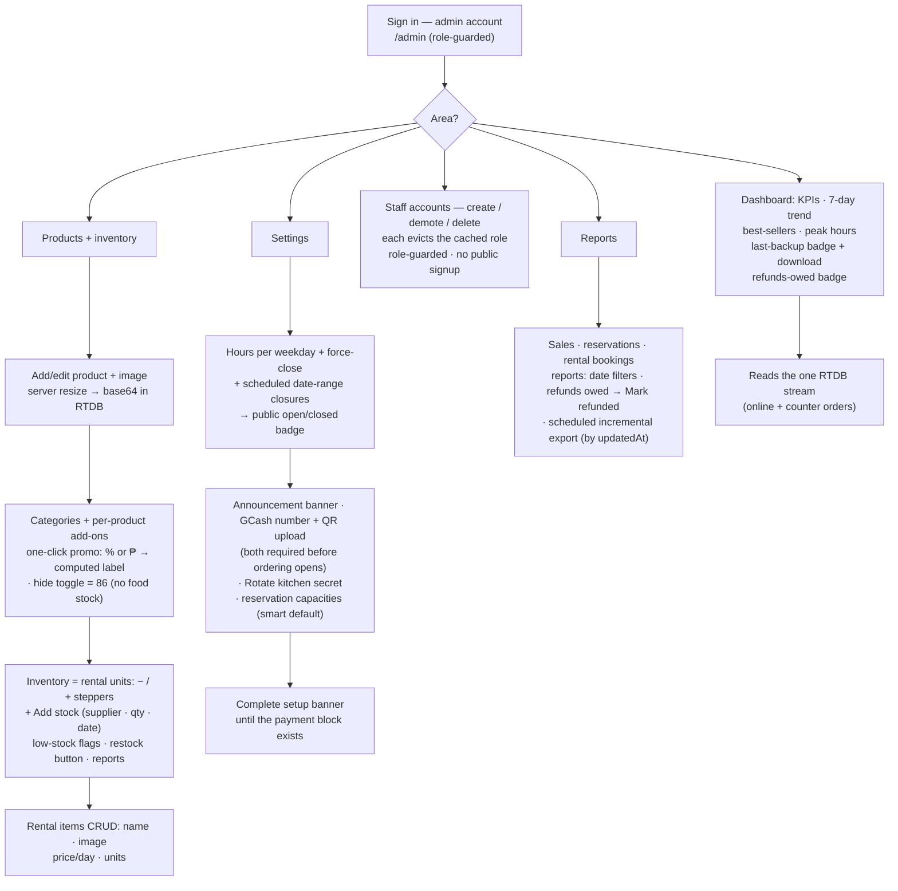

# Admin flowchart

```mermaid
flowchart TD
    A["Sign in — admin account<br/>/admin (role-guarded)"] --> B{"Area?"}
    B --> C["Dashboard: KPIs · 7-day trend<br/>best-sellers · peak hours<br/>last-backup badge + download<br/>refunds-owed badge"]
    B --> D["Products + inventory"]
    B --> SA["Staff accounts — create / demote / delete<br/>each evicts the cached role<br/>role-guarded · no public signup"]
    B --> E["Settings"]
    B --> F["Reports"]
    D --> D1["Add/edit product + image<br/>server resize → base64 in RTDB"]
    D1 --> D2["Categories + per-product add-ons<br/>one-click promo: % or ₱ → computed label<br/>· hide toggle = 86 (no food stock)"]
    D2 --> D3["Inventory = rental units: − / + steppers<br/>+ Add stock (supplier · qty · date)<br/>low-stock flags · restock button · reports"]
    D3 --> D4["Rental items CRUD: name · image<br/>price/day · units"]
    E --> E1["Hours per weekday + force-close<br/>+ scheduled date-range closures<br/>→ public open/closed badge"]
    E1 --> E2["Announcement banner · GCash number + QR upload<br/>(both required before ordering opens)<br/>· Rotate kitchen secret<br/>· reservation capacities (smart default)"]
    E2 --> E3["Complete setup banner<br/>until the payment block exists"]
    F --> F1["Sales · reservations · rental bookings<br/>reports: date filters · refunds owed → Mark refunded<br/>· scheduled incremental export (by updatedAt)"]
    C --> G["Reads the one RTDB stream<br/>(online + counter orders)"]
```
