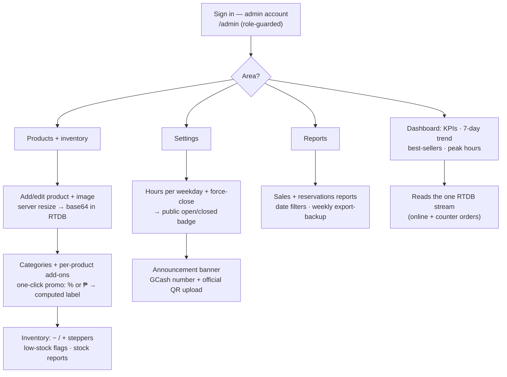

# Admin flowchart

```mermaid
flowchart TD
    A["Sign in — admin account<br/>/admin (role-guarded)"] --> B{"Area?"}
    B --> C["Dashboard: KPIs · 7-day trend<br/>best-sellers · peak hours"]
    B --> D["Products + inventory"]
    B --> E["Settings"]
    B --> F["Reports"]
    D --> D1["Add/edit product + image<br/>server resize → base64 in RTDB"]
    D1 --> D2["Categories + per-product add-ons<br/>one-click promo: % or ₱ → computed label"]
    D2 --> D3["Inventory: − / + steppers<br/>low-stock flags · stock reports"]
    E --> E1["Hours per weekday + force-close<br/>→ public open/closed badge"]
    E1 --> E2["Announcement banner<br/>GCash number + official QR upload"]
    F --> F1["Sales + reservations reports<br/>date filters · weekly export-backup"]
    C --> G["Reads the one RTDB stream<br/>(online + counter orders)"]
```
