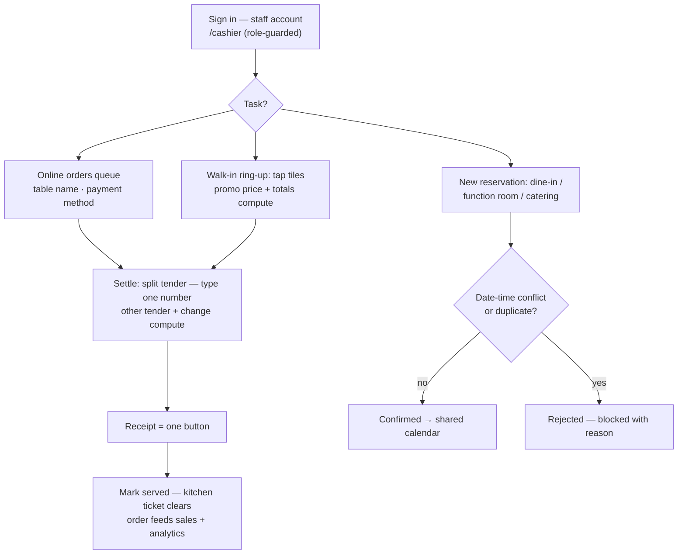

# Cashier (POS) flowchart

```mermaid
flowchart TD
    A["Sign in — staff account<br/>/cashier (role-guarded)"] --> B{"Task?"}
    B --> C["Online orders queue<br/>table name · payment method"]
    B --> D["Walk-in ring-up: tap tiles<br/>promo price + totals compute"]
    B --> E["New reservation: dine-in /<br/>function room / catering"]
    C --> F["Settle: split tender — type one number<br/>other tender + change compute"]
    D --> F
    F --> G["Receipt = one button"]
    G --> H["Mark served — kitchen ticket clears<br/>order feeds sales + analytics"]
    E --> I{"Date-time conflict<br/>or duplicate?"}
    I -->|"no"| J["Confirmed → shared calendar"]
    I -->|"yes"| K["Rejected — blocked with reason"]
```
