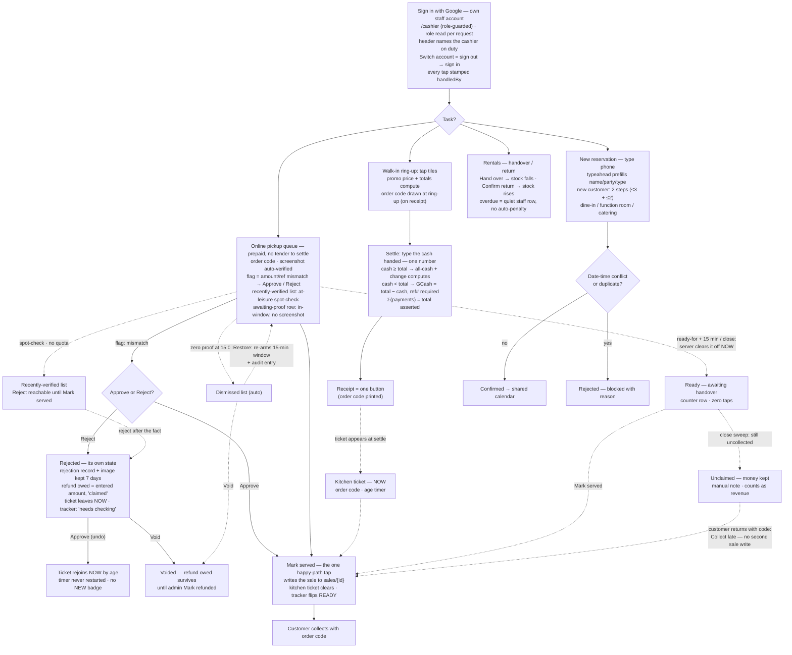

# Cashier (POS) flowchart

One tap per online order on the happy path: **Mark served**.
Proof auto-verifies; only an amount/ref mismatch flags — one-tap
**Approve / Reject**, the exception. Every tap is status-guarded: a
stale or duplicate tap is a friendly no-op.

