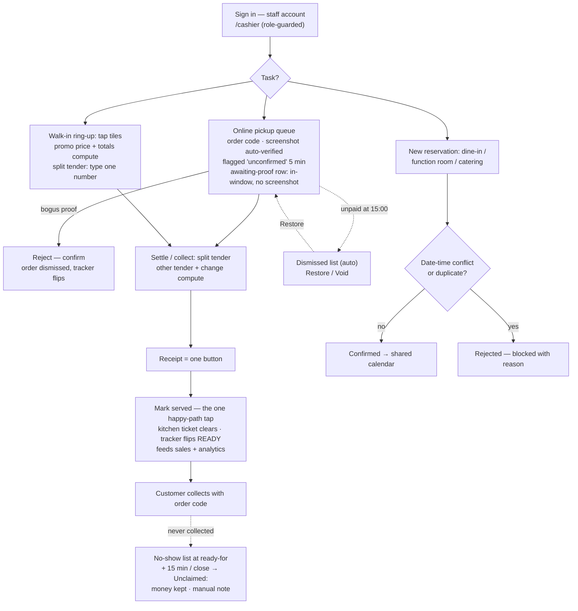

# Cashier (POS) flowchart

One tap per online order on the happy path: **Mark served**.
Proof auto-verifies; the cashier taps **Reject** only on exception.

```mermaid
flowchart TD
    A["Sign in — staff account<br/>/cashier (role-guarded)"] --> B{"Task?"}
    B --> C["Online pickup queue<br/>order code · screenshot auto-verified<br/>flagged 'unconfirmed' 5 min<br/>awaiting-proof row: in-window, no screenshot"]
    B --> D["Walk-in ring-up: tap tiles<br/>promo price + totals compute<br/>split tender: type one number"]
    B --> E["New reservation: dine-in /<br/>function room / catering"]
    C -->|"bogus proof"| R["Reject — confirm<br/>order dismissed, tracker flips"]
    C --> F["Settle / collect: split tender<br/>other tender + change compute"]
    D --> F
    F --> G["Receipt = one button"]
    G --> H["Mark served — the one happy-path tap<br/>kitchen ticket clears · tracker flips READY<br/>feeds sales + analytics"]
    H --> I["Customer collects with order code"]
    I -.->|"never collected"| U["No-show list at ready-for<br/>+ 15 min / close → Unclaimed:<br/>money kept · manual note"]
    C -.->|"unpaid at 15:00"| X["Dismissed list (auto)<br/>Restore / Void"]
    X -.->|"Restore"| C
    E --> J{"Date-time conflict<br/>or duplicate?"}
    J -->|"no"| K["Confirmed → shared calendar"]
    J -->|"yes"| L["Rejected — blocked with reason"]
```
