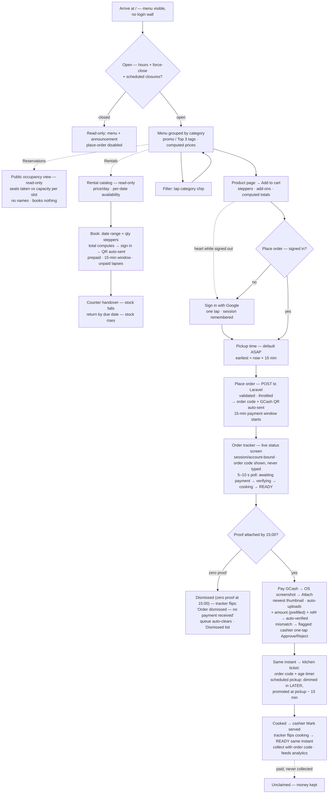

# Customer flowchart

Browse is open to everyone; ordering requires Sign in with Google.
Online orders are pickup-only, GCash-only, identified by order code.

```mermaid
flowchart TD
    A["Arrive at / — menu visible,<br/>no login wall"] --> B{"Open — hours + force-close<br/>+ scheduled closures?"}
    B -->|"closed"| C["Read-only: menu + announcement<br/>place-order disabled"]
    B -->|"open"| D["Menu grouped by category<br/>promo / Top 3 tags · computed prices"]
    D -.->|"Reservations"| V["Public occupancy view — read-only<br/>seats taken vs capacity per slot<br/>no names · books nothing"]
    D -.->|"Rentals"| RC["Rental catalog — read-only<br/>price/day · per-date availability"]
    RC --> RD["Book: date range + qty steppers<br/>total computes → sign in → QR auto-sent<br/>prepaid · 15-min window · unpaid lapses"]
    RD --> RH["Counter handover — stock falls<br/>return by due date — stock rises"]
    D --> E["Filter: tap category chip"]
    E --> D
    D --> F["Product page → Add to cart<br/>steppers · add-ons · computed totals"]
    F -.->|"heart while signed out"| G
    F --> H{"Place order — signed in?"}
    H -->|"no"| G["Sign in with Google<br/>one tap · session remembered"]
    G --> I["Pickup time — default ASAP<br/>earliest = now + 15 min"]
    H -->|"yes"| I
    I --> J["Place order — POST to Laravel<br/>validated · throttled<br/>→ order code + GCash QR auto-sent<br/>15-min payment window starts"]
    J --> T["Order tracker — live status screen<br/>session/account-bound · order code shown, never typed<br/>5–10 s poll: awaiting payment → verifying → cooking → READY"]
    T --> K{"Proof attached by 15:00?"}
    K -->|"zero proof"| L["Dismissed (zero proof at 15:00) — tracker flips:<br/>'Order dismissed — no payment received'<br/>queue auto-clears · Dismissed list"]
    K -->|"yes"| M["Pay GCash → OS screenshot → Attach<br/>newest thumbnail · auto-uploads<br/>+ amount (prefilled) + ref# → auto-verified<br/>mismatch → flagged: cashier one-tap Approve/Reject"]
    M --> N["Same instant → kitchen ticket:<br/>order code + age timer<br/>scheduled pickup: dimmed in LATER,<br/>promoted at pickup − 15 min"]
    N --> O["Cooked → cashier Mark served<br/>tracker flips cooking → READY same instant<br/>collect with order code · feeds analytics"]
    O -.->|"paid, never collected"| P["Unclaimed — money kept"]
```
