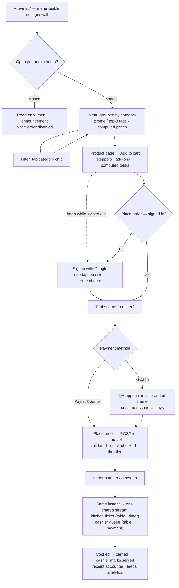

# Customer flowchart

Browse is open to everyone; ordering requires Sign in with Google.

```mermaid
flowchart TD
    A["Arrive at / — menu visible,<br/>no login wall"] --> B{"Open per admin hours?"}
    B -->|"closed"| C["Read-only: menu + announcement<br/>place-order disabled"]
    B -->|"open"| D["Menu grouped by category<br/>promo / top-3 tags · computed prices"]
    D --> E["Filter: tap category chip"]
    E --> D
    D --> F["Product page → Add to cart<br/>steppers · add-ons · computed totals"]
    F -.->|"heart while signed out"| G
    F --> H{"Place order — signed in?"}
    H -->|"no"| G["Sign in with Google<br/>one tap · session remembered"]
    G --> I["Table name (required)"]
    H -->|"yes"| I
    I --> J{"Payment method"}
    J -->|"Pay at Counter"| K["Place order — POST to Laravel<br/>validated · stock-checked · throttled"]
    J -->|"GCash"| L["QR appears in its branded frame<br/>customer scans → pays"]
    L --> K
    K --> M["Order number on screen"]
    M --> N["Same instant → one shared stream:<br/>kitchen ticket (table · timer)<br/>cashier queue (table · payment)"]
    N --> O["Cooked → carried → cashier marks served<br/>receipt at counter · feeds analytics"]
```
