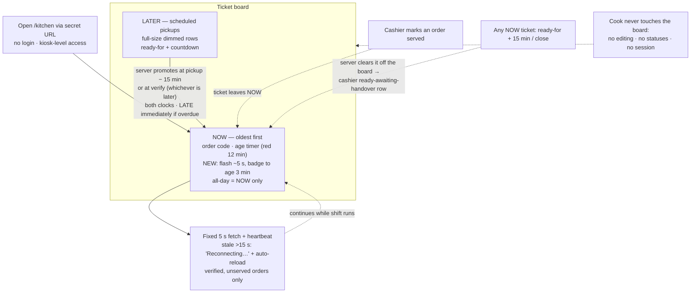

# Kitchen flowchart

Read-only by design: zero input, zero login, zero cook interaction.
The server owns lanes, promotion, and expiry — the cook owns nothing.

```mermaid
flowchart TD
    A["Open /kitchen via secret URL<br/>no login · kiosk-level access"] --> N
    subgraph Board["Ticket board"]
        N["NOW — oldest first<br/>order code · age timer (red 12 min)<br/>NEW: flash ~5 s, badge to age 3 min<br/>all-day = NOW only"]
        L["LATER — scheduled pickups<br/>full-size dimmed rows<br/>ready-for + countdown"]
    end
    L -->|"server promotes at pickup − 15 min<br/>or at verify (whichever is later)<br/>both clocks · LATE immediately if overdue"| N
    N --> R["Fixed 5 s fetch + heartbeat<br/>stale >15 s: 'Reconnecting…' + auto-reload<br/>verified, unserved orders only"]
    R -.->|"continues while shift runs"| N
    S["Cashier marks an order served"] -.->|"ticket leaves NOW"| N
    X["Any NOW ticket: ready-for + 15 min / close"] -.->|"server clears it off the board →<br/>cashier ready-awaiting-handover row"| N
    E["Cook never touches the board:<br/>no editing · no statuses · no session"] -.-> Board
```
