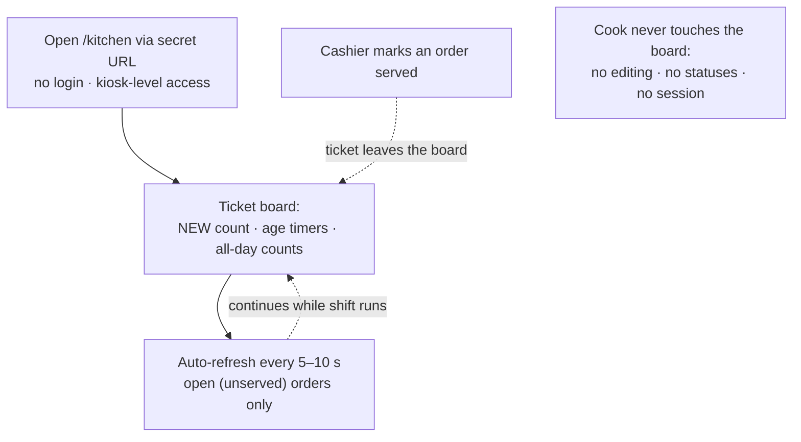

# Kitchen flowchart

Read-only by design: zero input, zero login, zero cook interaction.

```mermaid
flowchart TD
    A["Open /kitchen via secret URL<br/>no login · kiosk-level access"] --> B["Ticket board:<br/>NEW count · age timers · all-day counts"]
    B --> C["Auto-refresh every 5–10 s<br/>open (unserved) orders only"]
    C -.->|"continues while shift runs"| B
    D["Cashier marks an order served"] -.->|"ticket leaves the board"| B
    E["Cook never touches the board:<br/>no editing · no statuses · no session"]
```
